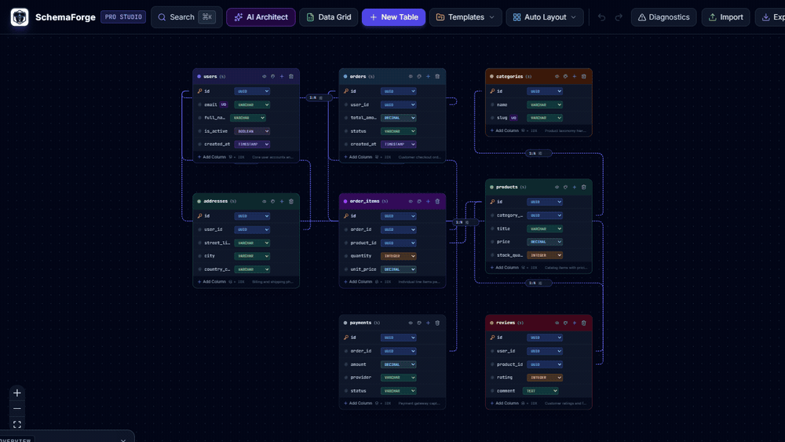
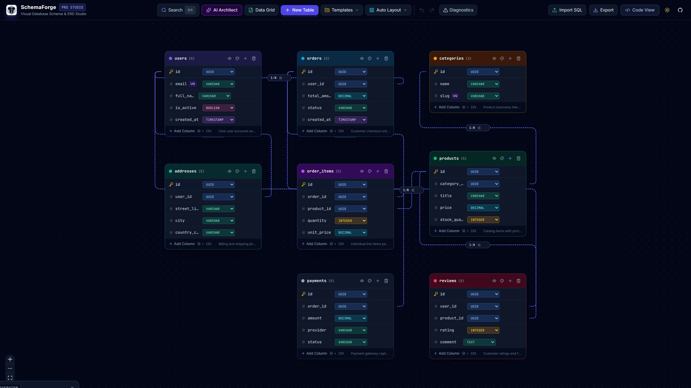
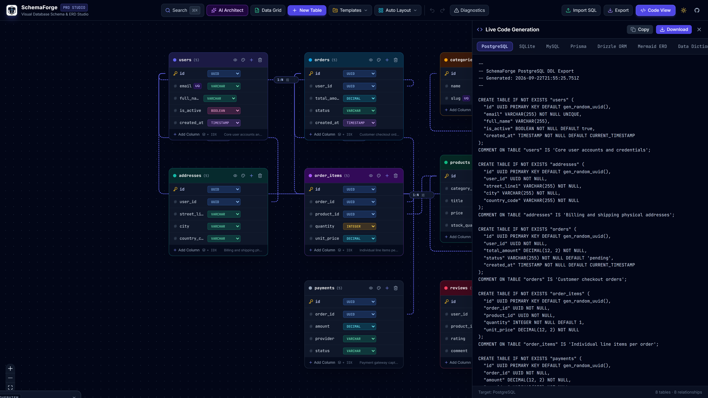
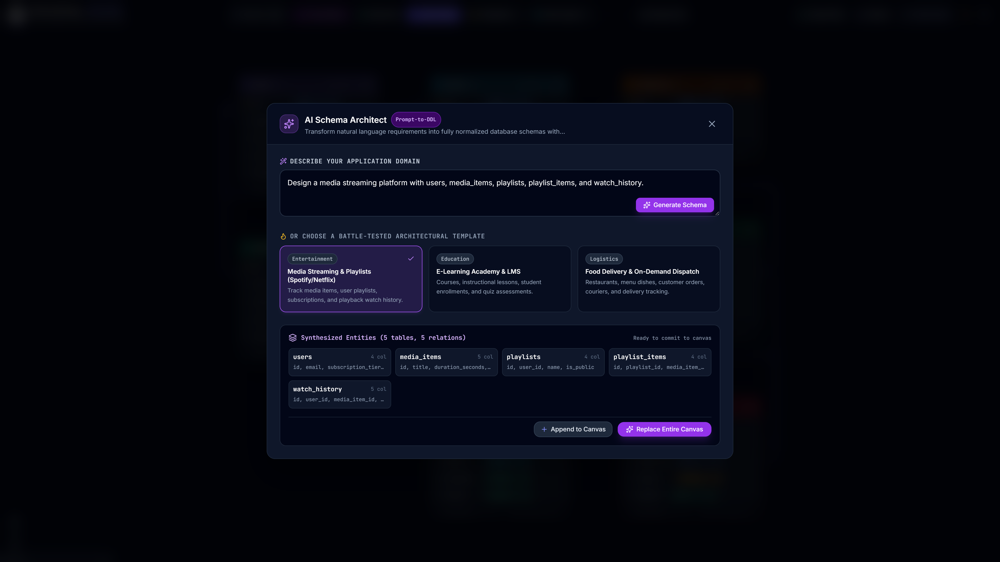
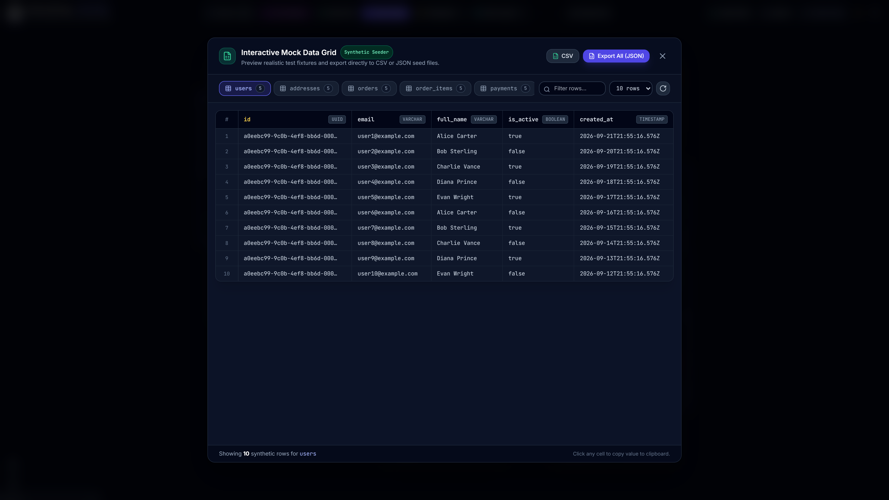
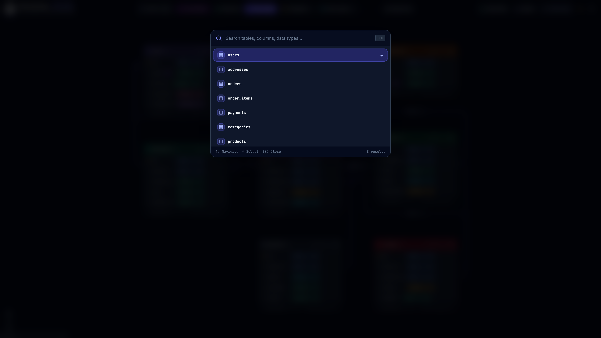

<p align="center">
  
</p>

<h1 align="center">SchemaForge</h1>

<p align="center">
  <strong>Interactive Visual Database Schema Designer, SQL Parser & Multi-Target Code Generation Studio</strong>
</p>

<p align="center">
  <a href="https://schemaforge-psi.vercel.app"></a>
  <a href="https://github.com/alexandrmotologa/schemaforge/actions"></a>
  <a href="LICENSE"></a>
  <a href="https://www.typescriptlang.org/"></a>
  <a href="https://react.dev/"></a>
  <a href="https://vitejs.dev/"></a>
</p>

<p align="center">
  <a href="https://schemaforge-psi.vercel.app"><strong>🚀 Launch Live Web App</strong></a> &nbsp;|&nbsp;
  <a href="#-visual-tour">Visual Tour</a> &nbsp;|&nbsp;
  <a href="#-features">Features</a> &nbsp;|&nbsp;
  <a href="#-supported-data-types">Data Types</a> &nbsp;|&nbsp;
  <a href="#-getting-started">Getting Started</a> &nbsp;|&nbsp;
  <a href="#-architecture">Architecture</a>
</p>

---

## Overview

SchemaForge is an in-browser relational schema modeler and Entity-Relationship Diagram (ERD) studio. It eliminates tedious manual migrations by combining an interactive node canvas with instant code generation for PostgreSQL, MySQL, SQLite, Prisma ORM, and Drizzle ORM.

Engineers can draft relational entities, visually connect foreign keys with customizable cardinalities, generate mock fixtures for seeded testing, and synthesize full database models from natural language prompts.

All operations execute client-side in WebAssembly and JavaScript—no cloud accounts, database credentials, or external API keys are required.

<p align="center">
  
</p>

---

## 📸 Visual Tour

### 1. Interactive Studio Canvas & ERD Modeling
Pan, zoom, and organize complex schemas on a dot-grid canvas with interactive handles, relationship badges, minimap navigation, and collision-free auto-layout.



---

### 2. Real-Time Multi-Target Code Generation
Inspect and download synchronized schema definitions in real-time across multiple dialects (PostgreSQL, SQLite, MySQL, Prisma, Drizzle ORM, Mermaid ERD, and Data Dictionary).



---

### 3. AI Schema Architect (Prompt-to-DDL)
Synthesize fully normalized database architectures directly from domain requirements or choose battle-tested blueprints for SaaS, E-Commerce, and FinTech.



---

### 4. Interactive Mock Data Grid & Synthetic Seeder
Inspect table rows populated with type-aware synthetic test fixtures, search cells, and export directly to CSV or JSON seed files.



---

### 5. Spotlight Search (`⌘K` / `Ctrl+K`)
Quickly jump to any table, column, or data type across large models with fuzzy search and keyboard navigation.



---

## ✨ Features

- **Fluid ERD Canvas:** Drag-and-drop table nodes with type badges, primary key/unique indicators, index pills, and bezier relationship lines.
- **Bi-Directional SQL Parser:** Paste raw `CREATE TABLE` DDL to automatically reconstruct visual tables, primary keys, and foreign key edges.
- **Multi-Dialect Generators:**
  - **PostgreSQL**: Standard DDL with `gen_random_uuid()`, constraints, and table comments.
  - **SQLite**: Clean DDL with `WITHOUT ROWID` options and native foreign keys.
  - **MySQL**: Strict InnoDB syntax with foreign key constraints and collation.
  - **Prisma**: Idiomatic `schema.prisma` definitions with `@relation` fields and `@id`.
  - **Drizzle ORM**: Type-safe TypeScript schema files utilizing `pgTable` constructs.
  - **Mermaid.js**: Standard ER diagrams for documentation and Markdown wikis.
  - **Data Dictionary**: Clean Markdown tables describing every table, column, type, and constraint.
- **Collision-Free Auto-Layout:** Dagre-powered topological layout with dynamic vertical push-down to prevent overlapping nodes when tables expand.
- **Synthetic Data Seeder:** Generates deterministic test fixtures adhering to column data types and foreign key relationships.
- **Real-Time Schema Linter:** Flags orphaned foreign keys, missing primary keys, redundant indexes, and naming collisions.
- **Adaptive Studio Layout:** Responsive navbar and drawer system optimized across viewports down to 800px with collapsible overflow controls.
- **Vector & Raster Exports:** Download high-resolution PNG snapshots or crisp vector SVGs for presentations and technical specs.

---

## 🗄️ Supported Data Types

| Category | Supported SQL Types |
| :--- | :--- |
| **Identifiers & Integers** | `UUID`, `SERIAL`, `BIGSERIAL`, `INTEGER`, `BIGINT`, `SMALLINT` |
| **Strings & Text** | `VARCHAR`, `TEXT`, `CHAR` |
| **Numeric & Floating-Point** | `DECIMAL`, `NUMERIC`, `REAL`, `DOUBLE PRECISION` |
| **Dates & Timestamps** | `TIMESTAMP`, `TIMESTAMPTZ`, `DATE`, `TIME` |
| **Structured & Logic** | `BOOLEAN`, `JSON`, `JSONB`, `BYTEA` |

---

## 🚀 Getting Started

### Prerequisites

- Node.js 18+
- npm 9+

### Installation

```bash
# Clone the repository
git clone https://github.com/alexandrmotologa/schemaforge.git
cd schemaforge

# Install dependencies
npm install
```

### Local Development

Start the development server:

```bash
npm run dev
```

Visit `http://localhost:3000` to launch the studio.

### Production Build

Compile TypeScript and build the optimized static bundle:

```bash
npm run build
```

The production assets are generated in `dist/`.

### Running Tests

Execute the unit test suite with Vitest:

```bash
npm test
```

---

## 📐 Architecture

```
schemaforge/
├── src/
│   ├── components/       # Visual React components (Canvas, Drawers, Modals, Nodes)
│   │   ├── nodes/        # Custom ReactFlow nodes (TableNode, ColumnRow)
│   │   ├── edges/        # Custom bezier curves and cardinality markers
│   │   └── modals/       # Data Grid, AI Architect, Import, Export
│   ├── engine/           # Pure, framework-agnostic schema engine
│   │   ├── types.ts      # Core AST definitions (Table, Column, Relationship)
│   │   ├── autoLayout.ts # Dagre layout computation & push-down collision solver
│   │   ├── mockDataGen.ts# Synthetic test fixture generator
│   │   ├── generators/   # SQL, Prisma, Drizzle, Mermaid, & Markdown exporters
│   │   └── parsers/      # SQL DDL tokenizer and AST builder
│   ├── hooks/            # Schema state machines and undo/redo stacks
│   └── App.tsx           # Studio root shell
├── docs/                 # In-depth architectural & generator documentation
│   ├── images/           # Brand identity assets (Aries Architect mascot logo)
│   └── screenshots/      # High-resolution application screenshots
└── public/               # Static assets & web manifest
```

For more details, see the documentation guides:
- [Architecture Overview](docs/architecture.md)
- [Code Generators Specification](docs/generators.md)
- [SQL Parser Guide](docs/sql-parser.md)
- [Contributing Guide](docs/contributing.md)

---

## 🛡️ Brand Identity

SchemaForge is represented by the **Aries Architect (Forge Ram)** mascot:

<p align="center">
  
</p>

- **Spiraling Geometric Horns:** Represent structural balance, foreign key constraints, and relational integrity.
- **Obsidian & Faceted Armor:** Reflects database durability (ACID) and robust storage architectures.
- **Cyan Keystone & Molten Amber Core:** Symbolizes schema synthesis and instant query compilation.

Brand vector files are available under [`docs/images/logo.svg`](docs/images/logo.svg).

---

## 📄 License

Distributed under the [MIT License](LICENSE). Copyright (c) 2026 Alexandr Motologa.
